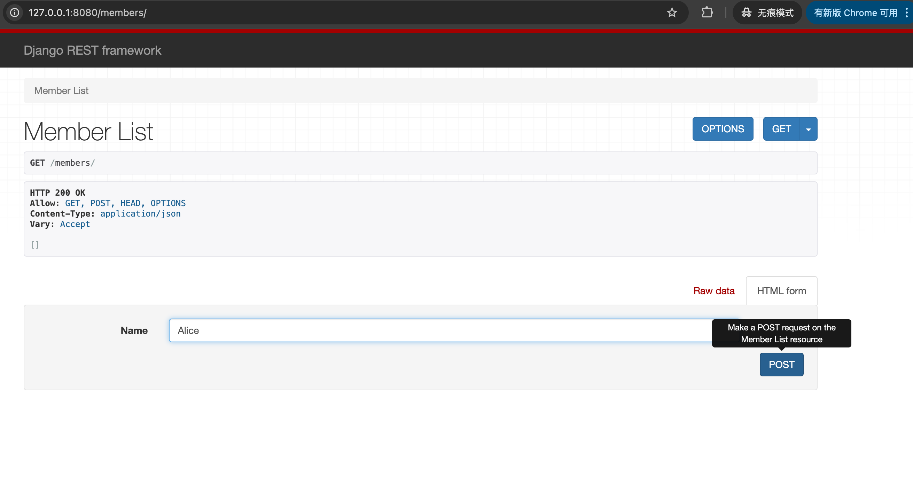
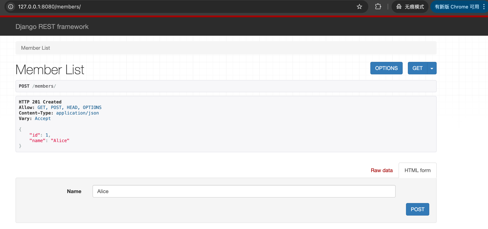
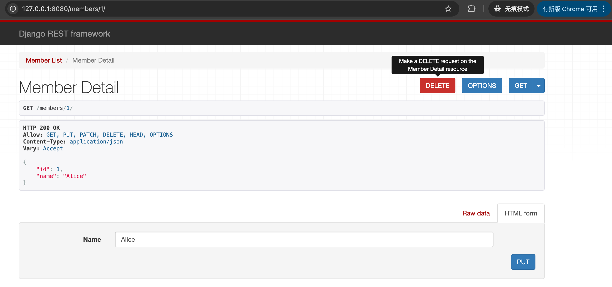
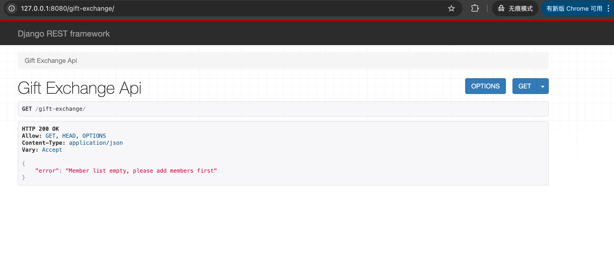
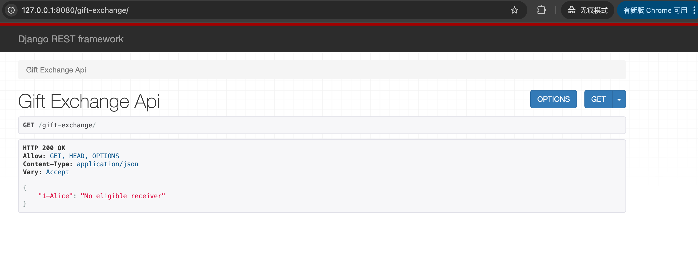
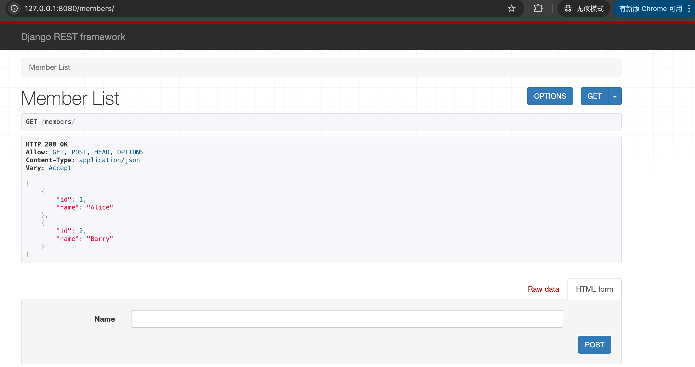
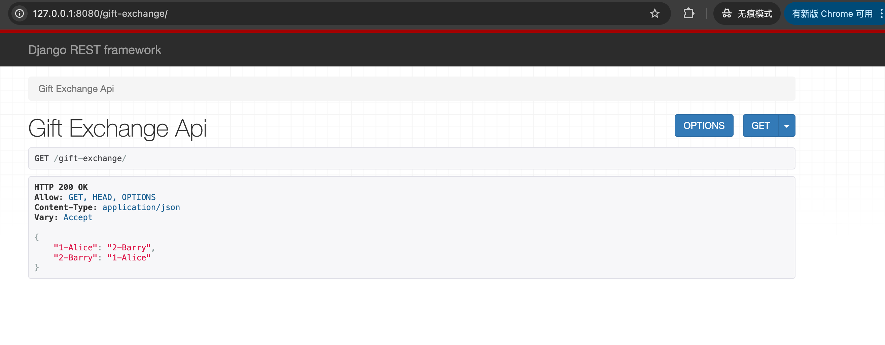
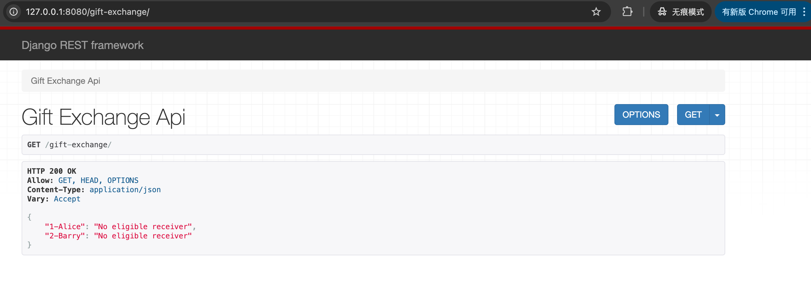

# Quick Start
If we need to quickly start the app and test it locally running as binary(versus containerized 
app and deployed to K8s), here are the steps:
```
pip3 install -r requirements.txt
python3 manage.py makemigrations
python3 manage.py migrate
python3 manage.py runserver 8080
```
After the server is running, the APIs can be accessed via browser with the URL:
http://127.0.0.1:8080/members/         (CRUD operation for memeber)
http://127.0.0.1:8080/gift-exchange/   (each get request will trigger a year's gift exchange 
given the server is continously running)   


# Micro Service Build process
Executing ```./build.sh``` will build the docker images( we could do "build and push" 
as 'ONE single step' in CICD automation. The person who builds an image in this case could also 
push the image into registry such as docker hub if he/she wants to try it out). 


# Micro Service Deploy process
## Deploy to Kubernetes cluster
Executing ```./deploy.sh``` will deploy our app into the K8s cluster as a micro service. 
There will be a Deployment, and also a Service (Kind).
Usually, we could add monitoring stack such as Prometheus etc, for simplicity we will ignore this part.
The yamls or Helm chart could be enriched too as needed(adding PVC, NetworkingPolicy, cpu/memory requests/limits etc.).


# Unit Test
## Usage 
Executing ```./test.sh``` will trigger the test commands.   
## Description 
Since each test case in the test file is standalone, and we have the in-memory `history`
variable when program is running, so the correct way to execute the test is to use the 
provided `test.sh`. 


# Data Storage
For Member info, we created a model for it and used the default sqlite database in Django.
For the exchange history(max past 3 years), it is a variable which is in-memory storage while program is running.


# Concurrency
Since this is a Django-based app, usually we would use `uwsgi` or `gunicorn` as the production-level
web server instead of the build-in `runserver`. 
In uwsgi or gunicorn, we can easily configure parameters like `process` and `thread` for concurrency purposes.


# Security
In Django's setting.py, we could set up a few security related parameters such as middleware security,
allowlist/blocklist etc.
From docker/k8s perspective, we also could set up things like running as non-root, resources requests/limits,
quota, network policy etc.


# Screenshots
## Create Member from Scratch


## List Members


## CRUD For Member


## Exchange With No Member


## Exchange With One Member


## Two Members Created


## Exchange With Two Member Year1


## Exchange With Two Member Year2
